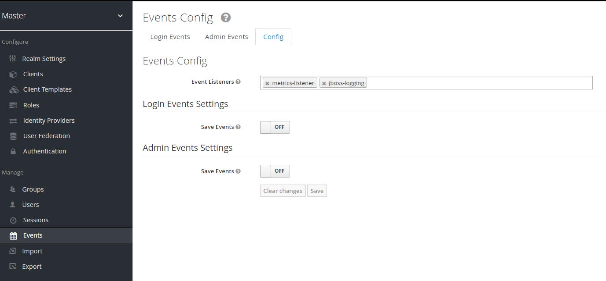

# keycloak spi for prometheus, exposing metrics

# Keycloak SPI Metrics

A [Service Provider](https://www.keycloak.org/docs/6.0/server_development/index.html#_providers) that extends Keycloak by adding a new endpoint. The endpoint should return metrics data ready to be scraped by [Prometheus](https://prometheus.io/).

Two different providers are defined:

* MetricsEventListener to record the internal Keycloak events
* MetricsEndpoint to expose the data through a custom endpoint

The endpoint lives under `<url>/auth/realms/<realm>/metrics`. It will return data for all realms.
you can visualize metrics by visiting the URL (default to `/auth/realms/master/metrics`).


## Build

The project is packaged as a jar file and bundles the prometheus client libraries.

```sh
$ mvn install
```

this command builds the jar and writes it to target/ with name `monitoring-1.0-SNAPSHOT-jar-with-dependencies.jar`.

## Usage

Just move the jar file to the {KEYCLOAK-HOME}\standalone\deployments keycloak directory.


In order to enable the event listener through Keycloak User interface, go to _Manage -> Events -> Config_. The _Event Listeners_ configuration should have an entry named `metrics-listener`.
as shown in the screenshot:

 

## Metrics

For each metric, the endpoint returns 2 or more lines of information:

* **# HELP**: A small description provided by the SPI.
* **# TYPE**: The type of metric, namely _counter_ and _gauge_. More info about types at [prometheus.io/docs](https://prometheus.io/docs/concepts/metric_types/).
* Provided there were any values, the last one recorded. If no value has been recorded yet, no more lines will be given.
* In case the same metric have different labels, there is a different line for each one. By default all metrics are labeled by realm. More info about labels at [prometheus.io/docs](https://prometheus.io/docs/practices/naming/).

Example:
```c
# HELP jvm_memory_bytes_committed Committed (bytes) of a given JVM memory area.
# TYPE jvm_memory_bytes_committed gauge
jvm_memory_bytes_committed{area="heap",} 2.00802304E8
jvm_memory_bytes_committed{area="nonheap",} 2.0217856E8
```

### JVM performance
A variety of JVM metrics are provided

### Generic events
Every single internal Keycloak event is being shared through the endpoint, with the descriptions `Generic Keycloak User event` or `Generic Keycloak Admin event`. Most of these events are not likely useful for the majority users but are provided for good measure. A complete list of the events can be found at [Keycloak documentation](http://www.keycloak.org/docs-api/3.2/javadocs/org/keycloak/events/EventType.html).

### Featured events
There are however a few events that are particularly more useful from a mobile app perspective. These events have been overriden by the SPI and are described more thoroughly below.

##### keycloak_logins
This counter counts every login performed by a non-admin user. It also distinguishes logins by the utilised identity provider by means of the label **provider**.

```c
# HELP keycloak_logins Total successful logins
# TYPE keycloak_logins gauge
keycloak_logins{realm="test",provider="keycloak",} 3.0
keycloak_logins{realm="test",provider="github",} 2.0
```

##### keycloak_failed_login_attempts
This counter counts every login performed by a non-admin user that fails, being the error described by the label **error**. It also distinguishes logins by the identity provider used by means of the label **provider**.

```c
# HELP keycloak_failed_login_attempts Total failed login attempts
# TYPE keycloak_failed_login_attempts gauge
keycloak_failed_login_attempts{realm="test",provider="keycloak",error="invalid_user_credentials"} 6.0
keycloak_failed_login_attempts{realm="test",provider="keycloak",error="user_not_found"} 2.0
```

##### keycloak_registrations
This counter counts every new user registration. It also distinguishes registrations by the identity provider used by means of the label **provider**.

```c
# HELP keycloak_registrations Total registered users
# TYPE keycloak_registrations gauge
keycloak_registrations{realm="test",provider="keycloak",} 1.0
keycloak_registrations{realm="test",provider="github",} 1.0
```

##### keycloak_request_duration
This histogram records the response times per route and http method and puts them in one of five buckets:

* Requests that take 2ms or less
* Requests that take 10ms or less
* Requests that take 100ms or less
* Requests that take 1s or less
* Any request that takes longer than 1s

The response from this type of metrics has the following format:

```c
# HELP keycloak_request_duration Request duration
# TYPE keycloak_request_duration histogram
keycloak_request_duration_bucket{method="GET",route="/admin/master/console/config",le="2.0",} 0.0
keycloak_request_duration_bucket{method="GET",route="/admin/master/console/config",le="10.0",} 1.0
keycloak_request_duration_bucket{method="GET",route="/admin/master/console/config",le="100.0",} 4.0
keycloak_request_duration_bucket{method="GET",route="/admin/master/console/config",le="1000.0",} 4.0
keycloak_request_duration_bucket{method="GET",route="/admin/master/console/config",le="+Inf",} 4.0
keycloak_request_duration_count{method="GET",route="/admin/master/console/config",} 4.0
keycloak_request_duration_sum{method="GET",route="/admin/master/console/config",} 1.0
```

This tells you that it has been zero requests that took less than 2ms. only one request which took less than 10ms. All the other requests took less than 100ms.

In addition of buckets, we can find also two important terms: the `sum` and `count` metrics for every route and method.

To get the average request duration over the last five minutes for the whole server you can just use the following Prometheus query:

```c
rate(keycloak_request_duration_sum[5m]) / rate(keycloak_request_duration_count[5m])
```

##### keycloak_response_errors
This counter counts the number of response errors (responses where the http status code is in the 400 or 500 range).

```c
# HELP keycloak_response_errors Total number of error responses
# TYPE keycloak_response_errors counter
keycloak_response_errors{code="500",method="GET",route="/",} 1
```